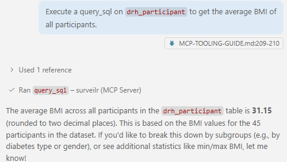
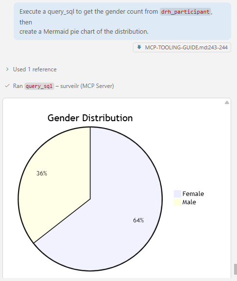

# DRH Edge Platform — MCP Orchestration & Prompting Guide

## Standard Operating Procedure | Diabetes Research Hub

> **Purpose:** This document is the SOP for every researcher and developer joining the DRH team. It ensures consistent, safe, and effective use of AI tools connected to the Diabetes Research Hub's clinical database.

---

## Table of Contents

1. [Schema Reference](#part-1--schema-reference)
2. [The MCP Ecosystem](#part-2--the-mcp-ecosystem)
3. [Setup & Configuration](#part-3--setup--configuration)
4. [MCP Tools & Execution Prompts](#part-4--mcp-tools--execution-prompts)
5. [New Researcher Onboarding SOP](#part-5--new-researcher-onboarding-sop)

---

## Part 1 — Schema Reference

The complete schema — all tables, views, types, descriptions, and example prompts — is maintained in:

```txt
.github/copilot-instructions.md
```

That file is the single source of truth for the database schema and is automatically loaded by GitHub Copilot as workspace context on every session. It covers:

- **Research Metadata & Administration** — study parameters, participants, investigators, publications
- **Time-Series Data** — CGM glucose traces, fitness, meal, and ingestion metadata
- **Advanced Clinical Analytics** — participant metrics, GRI, TIR, AGP, advanced scores, dashboards
- **System Integrity & Privacy** — anonymization audit, device registry, session health, OpenTelemetry logs
- **Critical additions** — `metric_definitions`, `metric_info_view`, `participant_cgm_date_range_view`, and circuit breaker patterns

> If you are updating the schema, **edit `copilot-instructions.md` only** — do not duplicate table definitions here.

---

## Part 2 — The MCP Ecosystem

The Model Context Protocol (MCP) acts like a universal connector for AI — standardizing how models communicate with data sources, tools, and local resources.

---

### 2.1 MCP Clients (The Hosts)

Clients are the applications where you interact with the AI.

| Client | Status | Notes for DRH |
|---|---|---|
| VS Code + GitHub Copilot | ✅ **Verified** | Primary environment. Uses `.vscode/mcp.json` for configuration. |
| Claude Desktop | ⚠️ Untested | Theoretically compatible via `mcp.json`; not yet validated for DRH workflows. |
| Cursor / Windsurf | ⚠️ Untested | Known MCP support; use at your own discretion until validated. |
| Claude Code (CLI) | ⚠️ Untested | Terminal-based agent; can run shell commands via MCP. Not validated for DRH. |

> **Platform Policy:** This SOP has been specifically optimized and tested for **VS Code with GitHub Copilot**. Other MCP clients may work but have not been validated by the core team. For the most stable experience, use the verified setup.

---

### 2.2 MCP Servers (The Data Sources)

Servers are the "drivers" that give the AI specific capabilities.

| Server | Purpose & Usage |
|---|---|
| `surveilr` (Local) | Core server. Translates natural language into SQL queries for your SQLite research database. No API key required. |

---

### 2.3 AI Models (The Brains)

| Model | Strengths for DRH |
|---|---|
| Claude 3.5 / 3.7 Sonnet | **Gold Standard for MCP.** Best at following complex SQL schemas with very few errors. Recommended primary model. |
| Gemini 2.0 Flash | Extremely fast. Excellent for parsing large file batches (50+ PDFs at once) through MCP. |
| GPT-4o | Highly reliable for general summaries and formatting data into structured tables. |

---

## Part 3 — Setup & Configuration

---

### 3.1 Configuration Files

#### A. `mcp.json

Place in your project root. Defines the connection to the `surveilr` binary and your local research database.

```json
{
  "servers": {
    "surveilr": {
      "command": "surveilr",
      "args": [
        "mcp",
        "server",
        "-d",
        "./drh-edge-core/resource-surveillance.sqlite.db"
      ],
      "env": {}
    }   
  }
}
```

#### B. `settings.json` (VS Code)

Tells GitHub Copilot where to find your MCP configuration.

```json
{
  "github.copilot.chat.mcp.enabled": true,
  "github.copilot.chat.mcp.configFile": ".vscode/mcp.json"
}
```

#### C. `.github/copilot-instructions.md`

Contains the **full schema reference and query rules**. Automatically loaded by Copilot as workspace context on every session. See [Part 1](#part-1--schema-reference) for what it covers.

> Do not paste schema content into `mcp.json` or `settings.json` — `copilot-instructions.md` is the only place it belongs.

---

### 3.2 Privacy & Security Note

> 🔒 **The `surveilr-mcp` server operates entirely on your local machine.**
>
> - **No API Keys:** Accessing your local research data does not require any external tokens.
> - **Zero-Cloud Data:** Your `.sqlite.db` is never uploaded to the AI provider. Only the specific results of your query (e.g., "The average BMI is 24") are sent to the model to help formulate an answer.

---

## Part 4 — MCP Tools & Execution Prompts

---

### 4.1 The Four Tools

Once `surveilr` is active, the AI gains four capabilities. You do not tell the AI which tool to use — you ask for a result, and the AI selects the correct tool.

| Tool | What It Does |
|---|---|
| `mcp_surveilr_query_sql` | Executes custom SQL. **Required for all Views.** Use for: filtering, aggregation, analysis. |
| `mcp_surveilr_get_table_sample` | Returns the first N rows of a physical Table. Use for: previewing data structure. |
| `mcp_surveilr_get_schema` | Shows column names and data types for a physical Table. Use for: schema discovery. |
| `mcp_surveilr_get_table_metadata` | Returns technical details about table relationships and primary keys. |

---

### 4.2 The Critical Rule — Tables vs. Views

| Object Type | Correct Tool | What Happens if Wrong Tool Used |
|---|---|---|
| Physical Table | `get_table_sample` or `get_schema` | Works correctly. |
| View | `mcp_surveilr_query_sql` | ❌ Error: `"Table not found"`. Views cannot use metadata tools. |

---

### 4.3 Execution Prompts by Use Case

#### Data Discovery

- **List all available tables**

```txt
List the tables available in database. Use surveilr mcp
```

*Logic: AI calls `get_schema` to enumerate all table names.*

---

#### Quality Checks

- **Check Validtaion status**

```txt
Execute a query_sql on the `drh_vv_session_summary` view to get the  validation status .Use surveilr mcp
```

*Logic: Must explicitly say "query_sql" and "view" — metadata tools fail on Views.*

---

- **Trace the processing pipeline**

```txt
Execute a query_sql on `drh_vv_hierarchy` to get the first 10 records.If the result is large get the count from drh_vv_session_summary to get the pass count and fail  count.
```

*Logic: AI drills into the hierarchy view to display the audit trail of each pipeline stage.*

---

#### Clinical Analysis

- **Compare participant demographics**

```txt
Execute a query_sql on `drh_participant` to get  the average BMI of
all participants.
```

---
<p align="left">

</p>
---

#### Data Auditing & Sampling

- **Sample raw CGM data**

```txt
Show me the first 5 rows of the `drh_raw_cgm_tracing` table.
```

*Logic: AI calls `get_table_sample` on the raw CGM table to preview the JSON payload structure.*

---

- **Audit anonymization**

```txt
Execute a query_sql on `drh_vw_orchestration_deidentify` to show which
records were anonymized in the last run.
```

*Logic: AI queries the deidentification audit log to verify privacy processing completed successfully.*

---

#### Visualization

- **Gender distribution chart**

```txt
Execute a query_sql to get the gender count from `drh_participant`, then
create a Mermaid pie chart of the distribution.
```

*Logic: AI queries the table for counts, then renders a Mermaid diagram in the chat window.*

---
<p align="left">

</p>

- **Study recruitment overview**

```txt
Execute a query_sql on `drh_study_vanity_metrics_details` and present the
recruitment statistics as a formatted summary table.
```

*Logic: AI queries study-wide demographic and recruitment stats and formats them for a report.*

---

### 4.4 Troubleshooting Common Issues

| Symptom | Fix |
|---|---|
| AI says `"I don't have access to the database"` | Remind it: `"Use the surveilr MCP tools to check the database."` This forces the AI to check its `mcp.json` configuration. |
| View query returns `"Table not found"` | Restate your prompt with `"Execute a query_sql on the [view name] view"` — never use metadata tools on Views. |
| MCP server fails to start | Verify the absolute path to your `.sqlite.db` in `mcp.json`. Relative paths silently fail when VS Code's working directory changes. |
| AI uses wrong glucose thresholds | Run: `"Execute a query_sql on metric_definitions to list study-specific glucose thresholds"` to ground the AI in your study parameters. |

---

## Part 5 — New Researcher Onboarding SOP

Follow these steps in order when joining the DRH team to enable your Local AI Research Assistant.

1. **Initialize the Environment** — Ensure you have the latest version of the repository and that your workspace root is the base of the `drh-edge-platform`.
2. **Verify the MCP Config** — Open `.vscode/mcp.json`. This file uses a relative path to bridge the `surveilr` binary to the local RSSD.
   1. - **Command**: `surveilr`
   2. - **Database Path**: `./drh-edge-core/resource-surveillance.sqlite.db`

3. **Enable VS Code Integration** — Open `.vscode/settings.json`. This is pre-configured to point to the local `mcp.json`. If you are using **GitHub Copilot**, ensure that "MCP support" is toggled **ON** in your Copilot settings.
4. **Review the Schema Rules** — Read `.github/copilot-instructions.md`. This is your "Rules of Engagement" for the AI. It explains which clinical tables are physical and which are virtual views.

- **Critical Rule**: If the AI says "Table not found," you must remind it to use the **`query_sql`** tool for views.

- **Test the Connection** — Open Copilot Chat in VS Code and run a test prompt:

> *"Check the overall_status from the `drh_vv_session_summary` view using **query_sql**."*

---

### **Summary of Final Configuration (Relative Paths)**

| File | Relative Path Reference | Purpose |
| --- | --- | --- |
| **`mcp.json`** | `./drh-edge-core/resource-surveillance.sqlite.db` | Connects AI to the local SQLite DB. |
| **`settings.json`** | `.vscode/mcp.json` | Tells VS Code where the AI config lives. |
| **`instructions.md`** | Local Workspace | Provides the "Brain" for the AI's clinical knowledge. |

---

### Quick Reference Card

| Goal | Object Type | Correct Prompt Pattern |
|---|---|---|
| Check Ingestion | View | `"Execute a query_sql on drh_vv_session_summary view..."` |
| Clinical Metrics | View | `"Execute a query_sql on drh_participant_metrics..."` |
| Schema Discovery | Table | `"Show the schema of the participant table."` |
| Data Sampling | Table | `"Show me the first 5 rows of combined_cgm_tracing_cached."` |
| Visualization | View | `"Query drh_participant and create a Mermaid pie chart..."` |

---

*DRH Edge Platform — Internal SOP. For questions, contact the core research engineering team.*
