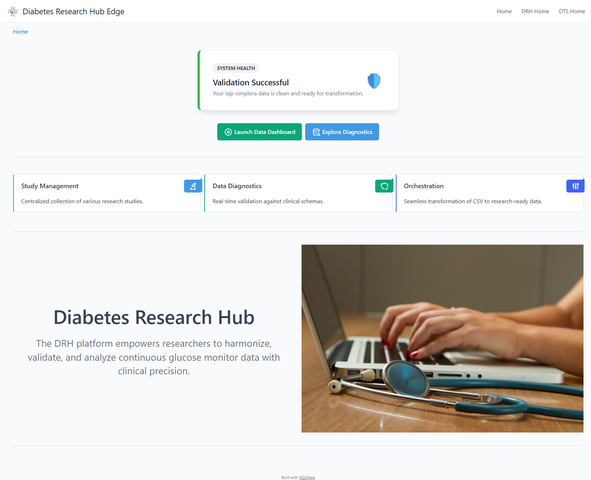
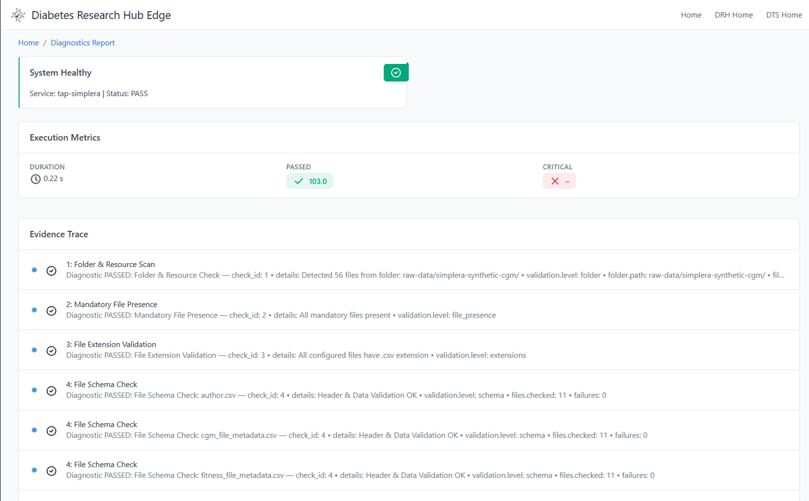
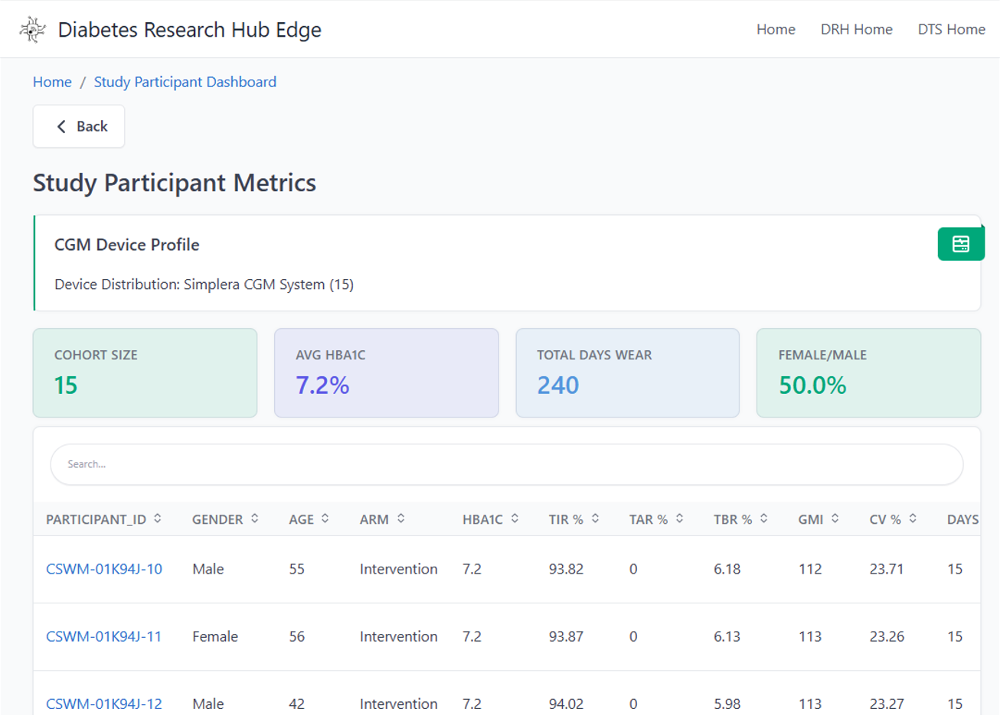
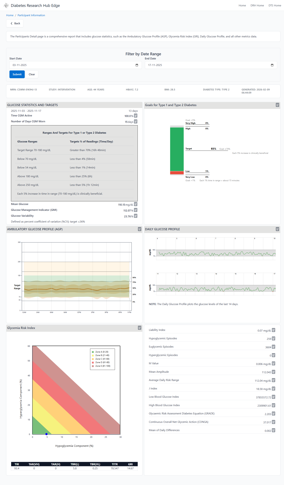

# DRH Edge Platform: Researcher & Data Scientist Guide

The **DRH Edge Platform** is an automated ecosystem designed to bridge the gap between raw diabetes research data and actionable clinical insights. It transforms disparate source files (e.g., CSV/Excel) into a validated, relational research database with a built-in visualization layer.

---

## 1. Core Architecture

The platform is built on three pillars to ensure data is standardized, observable, and automated:

* **Standardization (Singer Protocol)**: Researchers write **Singer Taps** to map unique source data to standardized **DRH Target Schemas** (Study, Participant, CGM Tracing). Detailed schema definitions are available in the [Singer DRH Protocol](https://github.com/diabetes-research/singer-drh-protocol) repository.
* **Observability (OpenTelemetry)**: Every ingestion run is monitored. If data fails validation, OTel logs provide the exact file and row causing the error. The OTEL schemas for spans, traces, and metrics are also integrated into the [DRH Target](https://github.com/diabetes-research/singer-drh-protocol) specification.
  > **Important**: Current observability is achieved through structured output.
  > An enhanced OpenTelemetry SDK-based implementation is currently being worked upon to provide deeper native instrumentation.
  > OpenTelemetry in DRH Edge is **diagnostic-only**.  
  > It never mutates data or controls execution flow directly.  
  > All gating decisions (PASS/FAIL) are derived from SQL views built on top of OTel output.

* **Orchestration (Executable Markdown)**: Documentation acts as code. Using **SPRY**, you execute "Runbook" tasks directly from `.md` files to trigger the entire pipeline.
* **Surveilr (The Engine)**: Acts as the core execution layer that runs the Singer Taps and executes SQL queries against the local SQLite database.

---

To set up a custom data integration for the **DRH Edge Platform**, follow this detailed guide. This workflow transitions from local script development to full automation within the DRH ecosystem.

---

## 2. Prerequisites & Environment Setup

Before starting, ensure your local machine is configured with the necessary core utilities. These tools manage everything from environment variables to data ingestion and observability.

| Tool | Role | Documentation |
| --- | --- | --- |
| **Python 3.8+** | Primary language for **Singer Taps** and the `drh-target` package. | [Python.org](https://docs.python.org/3/) |
| **Spry** | Orchestrates tasks (bash/SQL) defined in Executable Markdown files. | [Spry Docs](https://docs.opsfolio.com/spry/getting-started/installation) |
| **Surveilr (v3.10+)** | The engine for data ingestion, OTel trace collection, and pipeline orchestration. | [Surveilr Docs](https://docs.opsfolio.com/surveilr/core/installation) |
| **direnv** | Loads environment variables from the `.envrc` block in your Markdown. | [direnv.net](https://direnv.net/) |

---

## 3. Developing Your Custom Integration

As a researcher, you can extend the platform to support any data source by following this "Clone-Map-Automate" workflow:

### Step 1: Clone and Configure

1. **Clone the Repository**: Download the latest [spry-drh-edge-platform](https://github.com/diabetes-research/spry-drh-edge-platform).
2. **Create Your Runbook**: Copy a sample Markdown file to use as a template (e.g., `cp drh-simplera-spry.md my-study.md`).
3. **Set Variables**: Update the `envrc` block in your new `.md` file (defining variables like `STUDY_DATA_PATH`). Sample [envrc block in md](drh-edge-core/assets/set-envrc.png)
4. Initialize them by running:

```bash
spry rb task prepare-env my-study.md
direnv allow
```

### Step 2: Developing Your Custom Singer Tap

Researchers can write custom **Singer Taps** to map unique data sources into standardized **DRH Target Schemas**. Use the existing sample at `drh-edge-core/singer-tap/tap-dexcom.surveilr[singer].py` as a reference.OTEL schemas are also defined in DRH target.

* **Dependency Management**: Python Taps should automatically check for a virtual environment (`venv`) and install dependencies, including the `drh-target` package.
* **Validation Logic**: Implement source-specific validation. If validation succeeds, emit both **SCHEMA** and **RECORD** messages. If it fails, only emit **OTEL** records containing the error spans, traces, and logs.OpenTelemetry in DRH Edge is diagnostic-only: it never mutates data or controls flow directly.
All validation gates and ETL decisions are derived from SQL views that aggregate OTel output.

> **Important**: Detailed validation implemented is explained [here.](https://github.com/diabetes-research/singer-drh-protocol?tab=readme-ov-file#opentelemetry-schema-and-validation-logging)

* **Test Locally**: Verify your mapping logic using standard Python before integrating it:

### A. Installation & Virtual Environment

It is best practice to use a virtual environment to manage dependencies, including the `drh-target` package required for OTel-backed validation.

```bash
# Create and activate a virtual environment
python3 -m venv venv
source venv/bin/activate

# Install the DRH Protocol package
pip install git+https://github.com/diabetes-research/singer-drh-protocol.git#subdirectory=drh-target/python-pkg
```

### B. Local Testing (Verification)

Before integrating with the full pipeline, test your tap independently to verify the `JSONL` output matches the expected Singer format.

```bash
# Execute the tap and save output to a text file for manual inspection
python3 singer-tap/tap-mydata.surveilr[singer].py > result_mydata.txt    
```

* **Verify**: Open `result_mydata.txt` to ensure it contains standard Singer messages (**SCHEMA**, **RECORD**, and **STATE**) mapped correctly to DRH target fields.

---

### C. Integrating with the Platform

Once your tap is verified, you can move to the automated ingestion phase.Use the `surveilr` tool to execute your tap. This processes the data and stores it in the `uniform_resource` table of your SQLite database while recording OpenTelemetry validation traces.

```bash
# Execute tap through surveilr for ingestion
# 
# 📝 Naming Convention:
# To be recognized as a Singer Tap by surveilr, the file must follow this pattern:
# [tap-name].surveilr[singer].[extension]
surveilr ingest files -r singer-tap/tap-mydata.surveilr[singer].py
```

### Step 3: Customizing SQL and ETL

* **Data Extraction & Validation**: Review `common-sql/drh-data-extraction.sql`. If your dataset requires unique logic extract from the ingested JSONL output, make a copy of this SQL file and modify the views accordingly. This step is critical for ensuring your specific data meets the hub's standards.
* **Core Tables for Cloud Integration**: To ensure compatibility with DRH cloud extraction, your ETL must populate these four primary tables defined in `drh-data-etl.sql`:

1. `participant_meal_fitness_data`: Combined meal-fitness data and metadata of participants.
2. `participant`: Subject demographics .
3. `study_metadata`: Research study and other accompanying data.
4. `file_meta_ingest_data`: Participant CGM data and cgm metadata based on each cgm tracing file.

* **Metric Generation**: `drh-data-etl.sql` incorporates the logic for generating the tables above, plus all common DRH views required for UI display and standardized diabetes metrics (e.g., Time-in-Range, GMI).
* **Transformation Engine**: Most data extraction from Singer JSON messages and metric calculations are written in SQLite-compatible SQL and executed via the command:

```bash
surveilr shell [path/to/sqlfile]
```

* **High-Performance Analytics (DuckDB)**: For resource-intensive analytical SQL or processing massive datasets, you can leverage the embedded DuckDB engine through `surveilr`:

```bash
surveilr shell --engine duckdb [path/to/your/duckdbanalytics-sql]
```

---

## 3. The Deployment Pipeline

The `prepare-db-deploy-server` task in your Markdown file orchestrates the transition from raw data to a live dashboard:

1. **Cleanup**: Removes stale `resource-surveillance.sqlite.db` and temporary UI artifacts.
2. **Ingestion**: Runs the Singer Tap via `surveilr ingest files -r [tap_path]`. Data is stored in the `uniform_resource` table while OTel monitors for errors.
3. **Validation Gate**: The script checks the `overall_status` in the `drh_vv_session_summary` view:
   1. * **PASS**: The ETL logic processes the raw data into research tables.
   2. * **FAIL**: ETL is skipped, and the UI is configured to display error diagnostics.

4. **UI Launch**: **SQLPage** renders the dashboard. The layout is defined under the `## Layout` section of your Markdown. Using `spry sp spc`, each block is packaged into the `sqlpage_files` table in the SQLite database to serve as navigation.
5. Execute the task block that defines all the above steps using

```bash
# Run the full Orchestration ((Execute TAP)Validate-Transform-Ingest -> ETL -> Package UI)
spry rb task prepare-db-deploy-server [your-markdown-file]
```

### Sample Orchestration Block

```bash prepare-db-deploy-server --descr "Performs pre-etl-validation, Ingestion, ETL and Server Deployment"
#!/bin/bash
set -u
# 1. Cleanup
rm -f resource-surveillance.sqlite.db 
rm -rf dev-src.auto 

# 2. Execute Dataset specific Singer Tap
surveilr ingest files -r singer-tap/tap-mydata.surveilr[\singer\].py

# 3. EXTRACT VIEWS FROM TAP OUTPUT
surveilr shell common-sql/drh-data-extraction.sql  
RAW_STATUS=$(surveilr shell "select overall_status from drh_vv_session_summary DESC LIMIT 1;")
VALIDATION_STATUS=$(echo "$RAW_STATUS" | jq -r '.[0].overall_status')

# 4. CONDITIONAL ETL EXECUTION
if [ "$VALIDATION_STATUS" == "PASS" ]; then    
    (
        set -e   
        surveilr shell common-sql/drh-data-etl.sql        
    )
    if [ $? -ne 0 ]; then exit 1; fi
else
    echo "Validation FAILED ($VALIDATION_STATUS). Skipping ETL steps."    
fi

# 5. INITIALIZE SQLPAGE (Runs in both PASS and FAIL scenarios)
spry sp spc --package --conf sqlpage/sqlpage.json -m drh-my-study.md | sqlite3 resource-surveillance.sqlite.db
```

## Standard Workflow Instructions

### Visualize Task Dependencies

```bash
spry rb run [markdownfilename] --visualize ascii-tree
```

Example:

```bash
spry rb run drh-simplera-spry.md --visualize ascii-tree
```

---

### List Defined Tasks

```bash
spry rb ls [markdownfilename]
```

---

### Option A: Step-by-Step Execution (Recommended)

1. **Prepare Environment**

   ```bash
   spry rb task prepare-env drh-simplera-spry.md
   ```

2. **Run ETL and Build UI**

   ```bash
   spry rb task prepare-db-deploy-server drh-simplera-spry.md
   ```

3. **Start SQLPage**

   ```bash
   surveilr web-ui
   ```

---

### Option B: Full Runbook Execution

```bash
spry rb run drh-simplera-spry.md
surveilr web-ui
```

```bash

# If SQLPage is already running on localhost:9227
sudo kill $(sudo lsof -t -i:9227) 
```

---

## 🎨 Platform Visual Showcase

The DRH Edge Platform provides a specialized interface for both **Data Engineers** (to ensure data integrity) and **Clinical Researchers** (to analyze study outcomes).

### 🏛️ Research Landing Page

The entry point provides a high-level summary of active studies, enrollment progress, and system health.

<p align="center">

</p>

### 🔍 Quality Assurance: The Validation Gate

The platform acts as a "Gatekeeper." If incoming data violates clinical schemas or structural rules, the ETL is automatically blocked to prevent database corruption.

| **The Validation Gate** | **OTel Diagnostic Logs** |
| --- | --- |
|  |  |
| **Gated Execution**: The UI prevents ETL progression if the `overall_status` is **FAIL**. | **Root Cause Analysis**: Deep-link diagnostics identify the exact CSV row and schema violation. |

<p align="center">

</p>

### 📊 Clinical Insights: Research Dashboards

Once data passes the gate, it is transformed into optimized relational tables for high-fidelity visualization and metric calculation.

| **Study Metrics & Participant Demographics** | **CGM Time-Series Analysis** |
| --- | --- |
|  |  |
| **Participant Overview**: Track demographics, enrollment status, and metadata. | **Glucose Tracings**: Interactive Time-in-Range (TIR) and GMI metrics. |

<p align="center">

</p>

### 🛠️ Participant & Device Metrics

Detailed drill-downs allow researchers to inspect individual participant traces, meal logs, and device performance metrics in a centralized view.

<p align="center">


<em>Comprehensive view of individual participant time-series data and clinical markers.</em>
</p>

---
